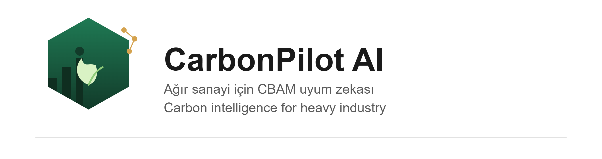
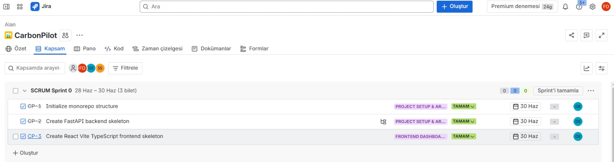
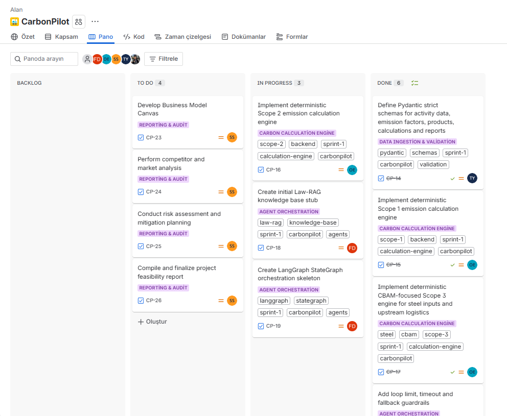
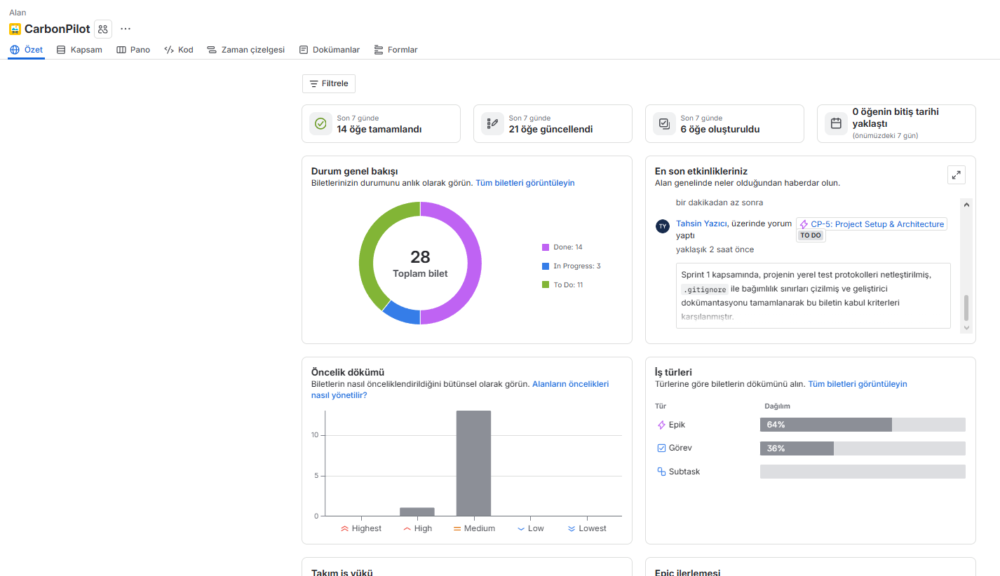
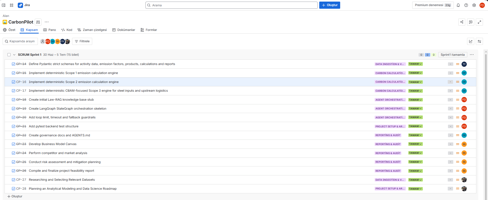
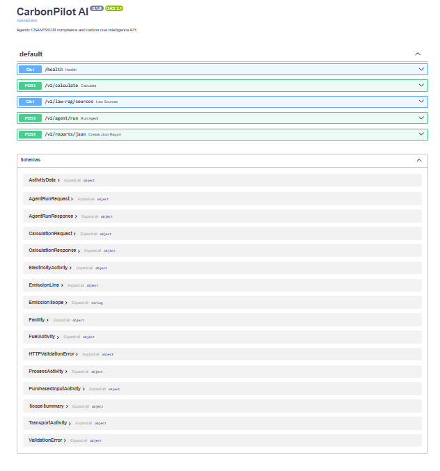
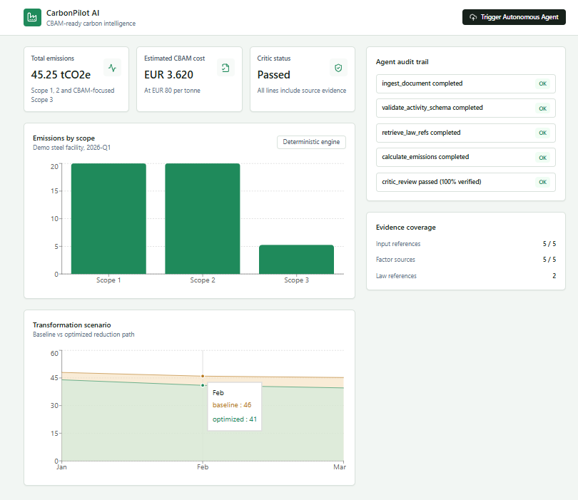

<p align="center">
  
</p>

<p align="center">
  
  
  
  
  
</p>

<h1 align="center">CarbonPilot AI</h1>
<p align="center"><i>CBAM/SKDM uyumluluğu için yapay zeka destekli karbon muhasebesi platformu</i></p>

<p align="center">
  <a href="#-türkçe">🇹🇷 Türkçe</a> •
  <a href="#-english">🇬🇧 English</a>
</p>

---

# 🇹🇷 Türkçe

## 📋 İçindekiler

- [Takım](#takım-ismi)
- [Ürün Bilgileri](#ürün-ile-ilgili-bilgiler)
- [Teknoloji Yığını](#tech-stack)
- [Repo Yapısı](#repository-structure)
- [Kurulum](#kurulum)
- [Sprint 1](#sprint-1-19-haziran--5-temmuz)

---

## Takım İsmi
Grup 9 – CarbonPilot AI

### 👔 Proje Ekibi & Roller

| İsim | Rol | Bağlantılar |
| :--- | :--- | :---: |
| **Fatma Nur Durmuş** | Scrum Master | [🌐 LinkedIn](https://www.linkedin.com/in/fatmanurdurmus/) \| [🐙 GitHub](https://github.com/fatmanurdurmus) |
| **Senem Selim** | Product Owner | [🌐 LinkedIn](https://www.linkedin.com/in/senemselim/) \| [🐙 GitHub](https://github.com/senemselim) |
| **Yaren Yurdakul** | Developer | [🌐 LinkedIn](https://www.linkedin.com/in/yaren-yurdakul-452096295/) \| [🐙 GitHub](https://github.com/yarenyurdakul) |
| **Onur Ergüden** | Developer | [🌐 LinkedIn](https://www.linkedin.com/in/onurerguden/?locale=tr) \| [🐙 GitHub](https://github.com/onurerguden) |
| **Tahsin Yazıcı** | Developer | [🌐 LinkedIn](https://www.linkedin.com/in/yazctahsin/) \| [🐙 GitHub](https://github.com/yazctahsin) |

## Ürün İle İlgili Bilgiler

### Ürün İsmi
CarbonPilot AI

### Ürün Açıklaması
CarbonPilot AI, demir-çelik başta olmak üzere ağır sanayi ihracatçılarının Avrupa Birliği Sınırda Karbon Düzenleme Mekanizması (SKDM/CBAM) yükümlülüklerini yönetebilmesi için geliştirilen, yapay zeka destekli bir karbon muhasebesi ve karar destek platformudur. Sistem; ERP logları, faturalar ve sevkiyat belgelerinden faaliyet verisini ayrıştırır, Kapsam 1/2/3 emisyonlarını deterministik Python koduyla hesaplar, ilgili mevzuat referanslarını (Law-RAG) getirir, sonuçları bir Critic Agent ile denetler ve denetlenebilir raporlar üretir.

### Ürün Özellikleri
- 🔒 Pydantic ile tip-güvenli veri şemaları (strict JSON)
- 📊 Deterministik Scope 1, Scope 2 ve CBAM-odaklı Scope 3 hesaplama motoru
- 🤖 LangGraph tabanlı agent orkestrasyonu (loop limit, timeout ve fallback guardrail'leri ile)
- 📚 Law-RAG mevzuat referans katmanı
- ✅ Critic Agent ile halüsinasyon/tutarlılık denetimi
- 📱 React + Tailwind ile mobil öncelikli karbon risk paneli

### Hedef Kitle
- Demir-çelik ve ağır sanayi ihracatçıları
- Çevre mühendisleri ve sürdürülebilirlik direktörleri
- Kurumsal denetçiler ve gümrük/uyum ekipleri

### Product Backlog URL
[Jira – CarbonPilot Board](https://onurerguden.atlassian.net/jira/software/projects/CP/boards/1/backlog?atlOrigin=eyJpIjoiMjY4MzRlZGUyN2ViNDNmMDhiZTJlMDI1ODFiYWNiMDMiLCJwIjoiaiJ9)

---

## Tech Stack

| Katman | Teknoloji |
|---|---|
| Backend | Python, FastAPI, Pydantic v2, SQLAlchemy/Alembic-ready |
| Agent Orchestration | LangGraph StateGraph (guarded loops, checkpoint-ready) |
| Database | PostgreSQL + pgvector |
| Frontend | React, Vite, TypeScript, Tailwind CSS, Recharts |
| Tests | pytest (backend), Vitest/Playwright-ready (frontend) |
| Observability | LangSmith-first configuration |

## Repository Structure

```text
apps/
  backend/        FastAPI, schemas, deterministic calculation engine, agent graph
  frontend/       React + Vite dashboard
docs/             Product, architecture, roadmap, Jira workflow, methodology
infra/            Docker Compose and database bootstrap assets
packages/         Shared schema notes for future generated contracts
ProjectManagement Bootcamp sprint artifacts
```

## Kurulum

### 1. Repoyu klonla
```bash
git clone https://github.com/fatmanurdurmus/YZTA-BOOTCAMP-GRUP-9.git
cd YZTA-BOOTCAMP-GRUP-9
```

### 2. Backend'i çalıştır
```bash
cd apps/backend
python3 -m venv .venv
source .venv/bin/activate        # Windows: .venv\Scripts\activate
pip install -e ".[dev]"
python -m pytest                 # testlerin geçtiğini doğrula
uvicorn carbonpilot.main:app --reload
```
API varsayılan olarak `http://localhost:8000` adresinde çalışır.

### 3. Frontend'i çalıştır
```bash
cd apps/frontend
npm install
npm run dev
```
Dashboard varsayılan olarak `http://localhost:5173` adresinde açılır.

## Safety Rules

- Do not push, force push, merge PRs, deploy, delete remote resources, or mark Jira issues Done without explicit approval.
- Emission calculations are deterministic Python code, never free-form LLM reasoning.
- LLM outputs must be schema-validated before entering the database, calculation engine, or reporting pipeline.

---

# Sprint 1 (19 Haziran – 5 Temmuz)

**Sprint Hedefi:** Monorepo, backend/frontend iskeletleri, tip-güvenli şemalar, Scope 1/2/CBAM-odaklı Scope 3 hesaplama motoru, Law-RAG stub'ı, LangGraph iskeleti, guardrail'ler ve pytest test yapısının kurulması.

- **Backlog düzeni ve Story seçimleri:** Sprint 1 kapsamı, projenin en yüksek riskli ve test edilmesi gereken çekirdek modüllerini (veri şeması, hesaplama motoru, agent orkestrasyonu) içerecek şekilde front-loading mantığıyla seçilmiştir (CP-14 – CP-22). Ayrıca ekibin iş modeli/pazar analizi çalışmaları (CP-23 – CP-28) aynı sprint içinde tamamlanmıştır.

- **Daily Scrum:** Daily Scrum toplantıları Slack ve WhatsApp üzerinden yürütülmüştür. Notlar: [Sprint 1 Daily Scrum Notları](https://github.com/fatmanurdurmus/YZTA-BOOTCAMP-GRUP-9/blob/main/ProjectManagement/Sprint1Documents/DailyScrumMeetingNotesSprint1.docx?raw=true)

- **Sprint board update:**

  <p align="center">
    
  </p>
  <p align="center">
    
  </p>
  <p align="center">
    
  </p>
  <p align="center">
    
  </p>

- **Ürün Durumu:**

  <p align="center">
    
  </p>
  <p align="center">
    
  </p>

- **Sprint Review:** Sprint 1 kapsamındaki 15 backlog kalemi (CP-14 – CP-28) tamamlanmıştır. Hesaplama motoru ve agent orkestrasyon iskeleti pytest ile doğrulanmıştır (9 test, tamamı geçiyor). Loop limit, timeout ve fallback guardrail'leri (CP-20) ve ek edge-case testleri (CP-21) sprint sonunda tamamlanarak eklenmiştir. Sprint Review katılımcıları: Tahsin, Onur, Fatma Nur, Senem, Yaren.

- **Sprint Retrospective:**
  - Jira board güncellemesinin kod ilerlemesinin gerisinde kaldığı fark edildi; bundan sonra her PR sonrası ilgili ticket anında güncellenecek.
  - Görev atamaları netleştirildi.
  - Test kapsamı (zero/invalid/edge-case) sprint ortasında değil, ticket açılırken tanımlanmalı.

---

# Sprint 2 

---

# Sprint 3 

---

# 🇬🇧 English

## 📋 Table of Contents

- [Team](#team-name)
- [Product Info](#about-the-product)
- [Tech Stack](#tech-stack-1)
- [Repository Structure](#repository-structure-1)
- [Setup](#setup)
- [Sprint 1](#sprint-1-june-19--july-5)

---

## Team Name
Group 9 – CarbonPilot AI

### 👔 Project Team & Roles

| Name | Role | Links |
| :--- | :--- | :---: |
| **Fatma Nur Durmuş** | Scrum Master | [🌐 LinkedIn](https://www.linkedin.com/in/fatmanurdurmus/) \| [🐙 GitHub](https://github.com/fatmanurdurmus) |
| **Senem Selim** | Product Owner | [🌐 LinkedIn](https://www.linkedin.com/in/senemselim/) \| [🐙 GitHub](https://github.com/senemselim) |
| **Yaren Yurdakul** | Developer | [🌐 LinkedIn](https://www.linkedin.com/in/yaren-yurdakul-452096295/) \| [🐙 GitHub](https://github.com/yarenyurdakul) |
| **Onur Ergüden** | Developer | [🌐 LinkedIn](https://www.linkedin.com/in/onurerguden/?locale=tr) \| [🐙 GitHub](https://github.com/onurerguden) |
| **Tahsin Yazıcı** | Developer | [🌐 LinkedIn](https://www.linkedin.com/in/yazctahsin/) \| [🐙 GitHub](https://github.com/yazctahsin) |

## About the Product

### Product Name
CarbonPilot AI

### Product Description
CarbonPilot AI is an AI-assisted carbon accounting and decision-support platform built for heavy industry exporters — primarily iron and steel producers — to manage their obligations under the EU Carbon Border Adjustment Mechanism (CBAM). The system ingests activity data from ERP logs, invoices, and shipment documents; calculates Scope 1/2/3 emissions with deterministic Python code; retrieves relevant legal references (Law-RAG); audits the output with a Critic Agent; and produces audit-ready reports.

### Product Features
- 🔒 Type-safe data schemas with Pydantic (strict JSON)
- 📊 Deterministic Scope 1, Scope 2, and CBAM-focused Scope 3 calculation engine
- 🤖 LangGraph-based agent orchestration (with loop limit, timeout, and fallback guardrails)
- 📚 Law-RAG legal reference layer
- ✅ Critic Agent for hallucination/consistency auditing
- 📱 Mobile-first carbon risk dashboard built with React + Tailwind

### Target Audience
- Iron, steel, and heavy industry exporters
- Environmental engineers and sustainability directors
- Corporate auditors and customs/compliance teams

### Product Backlog URL
[Jira – CarbonPilot Board](https://onurerguden.atlassian.net/jira/software/projects/CP/boards/1/backlog?atlOrigin=eyJpIjoiMjY4MzRlZGUyN2ViNDNmMDhiZTJlMDI1ODFiYWNiMDMiLCJwIjoiaiJ9)

---

## Tech Stack

| Layer | Technology |
|---|---|
| Backend | Python, FastAPI, Pydantic v2, SQLAlchemy/Alembic-ready |
| Agent Orchestration | LangGraph StateGraph (guarded loops, checkpoint-ready) |
| Database | PostgreSQL + pgvector |
| Frontend | React, Vite, TypeScript, Tailwind CSS, Recharts |
| Tests | pytest (backend), Vitest/Playwright-ready (frontend) |
| Observability | LangSmith-first configuration |

## Repository Structure

```text
apps/
  backend/        FastAPI, schemas, deterministic calculation engine, agent graph
  frontend/       React + Vite dashboard
docs/             Product, architecture, roadmap, Jira workflow, methodology
infra/            Docker Compose and database bootstrap assets
packages/         Shared schema notes for future generated contracts
ProjectManagement Bootcamp sprint artifacts
```

## Setup

### 1. Clone the repository
```bash
git clone https://github.com/fatmanurdurmus/YZTA-BOOTCAMP-GRUP-9.git
cd YZTA-BOOTCAMP-GRUP-9
```

### 2. Run the backend
```bash
cd apps/backend
python3 -m venv .venv
source .venv/bin/activate        # Windows: .venv\Scripts\activate
pip install -e ".[dev]"
python -m pytest                 # verify all tests pass
uvicorn carbonpilot.main:app --reload
```
The API runs at `http://localhost:8000` by default.

### 3. Run the frontend
```bash
cd apps/frontend
npm install
npm run dev
```
The dashboard opens at `http://localhost:5173` by default.

## Safety Rules

- Do not push, force push, merge PRs, deploy, delete remote resources, or mark Jira issues Done without explicit approval.
- Emission calculations are deterministic Python code, never free-form LLM reasoning.
- LLM outputs must be schema-validated before entering the database, calculation engine, or reporting pipeline.

---

# Sprint 1 (June 19 – July 5)

**Sprint Goal:** Establish the monorepo, backend/frontend skeletons, strict schemas, Scope 1/2/CBAM-focused Scope 3 calculation engine, Law-RAG stub, LangGraph skeleton, guardrails, and pytest structure.

- **Backlog structure and story selection:** Sprint 1 scope was chosen using a front-loading approach, prioritizing the project's highest-risk, most test-critical core modules (data schemas, calculation engine, agent orchestration) — CP-14 through CP-22. The team's business model / market analysis work (CP-23 – CP-28) was also completed within the same sprint.

- **Daily Scrum:** Daily Scrum meetings were held via Slack and WhatsApp due to scheduling constraints. Notes: [Sprint 1 Daily Scrum Notes](https://github.com/fatmanurdurmus/YZTA-BOOTCAMP-GRUP-9/blob/main/ProjectManagement/Sprint1Documents/DailyScrumMeetingNotesSprint1.docx?raw=true)

- **Sprint board update:**

  <p align="center">
    
  </p>
  <p align="center">
    
  </p>
  <p align="center">
    
  </p>
  <p align="center">
    
  </p>

- **Product Status:**

  <p align="center">
    
  </p>
  <p align="center">
    
  </p>

- **Sprint Review:** All 15 backlog items in Sprint 1 (CP-14 – CP-28) were completed. The calculation engine and agent orchestration skeleton were verified with pytest (9 tests, all passing). Loop limit, timeout, and fallback guardrails (CP-20) and additional edge-case tests (CP-21) were completed at the end of the sprint. Sprint Review attendees: Tahsin, Onur, Fatma Nur, Senem, Yaren.

- **Sprint Retrospective:**
  - We noticed the Jira board had fallen behind actual code progress; from now on, each ticket will be updated immediately after the related PR.
  - Task assignments were clarified.
  - Test coverage (zero/invalid/edge-case) should be defined when a ticket is opened, not mid-sprint.

---

# Sprint 2 

---

# Sprint 3 