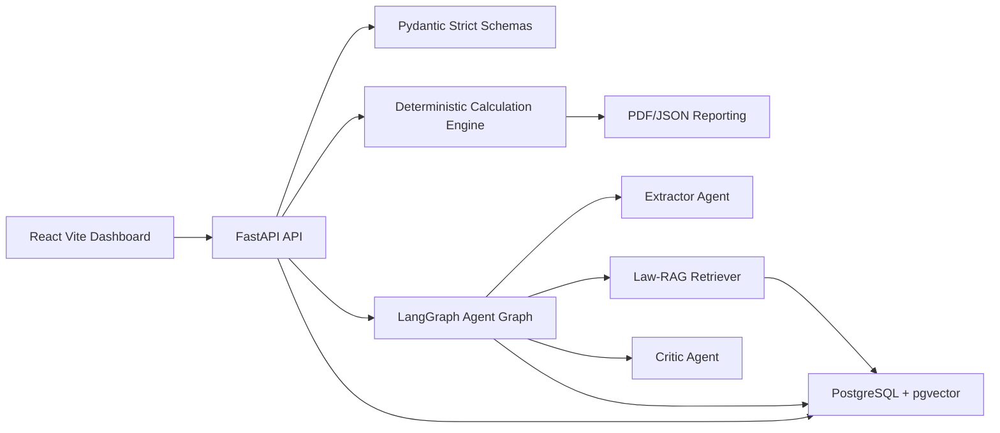
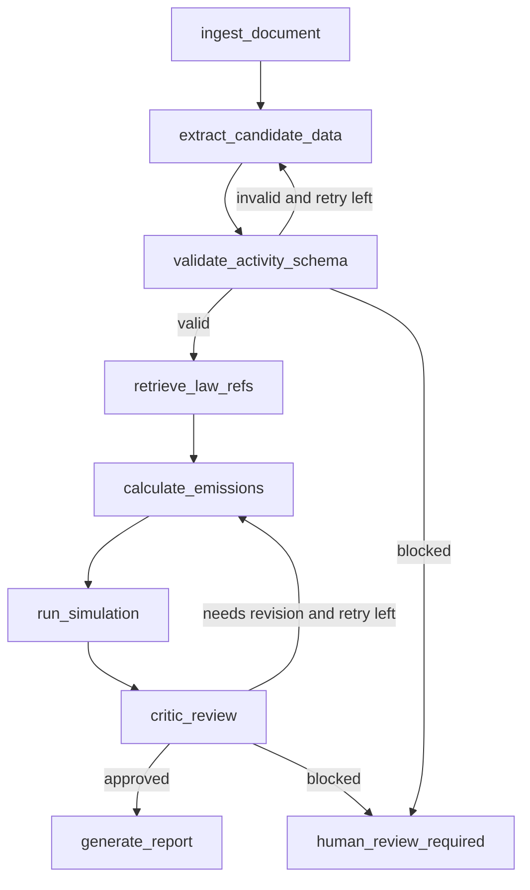

# Architecture

## System Shape

CarbonPilot AI is a monorepo with a FastAPI backend, React/Vite frontend, PostgreSQL/pgvector persistence, and LangGraph orchestration. The architecture separates deterministic calculation from LLM-supported extraction, explanation, and critique.

## Backend Modules

- `schemas`: strict Pydantic v2 request/response and domain models.
- `calculation`: deterministic Scope 1, Scope 2, Scope 3, totals, and audit lines.
- `law_rag`: legal/reference retrieval contract and initial static CBAM/GHG source stubs.
- `agents`: LangGraph state and guarded graph runner.
- `critic`: deterministic and LLM-ready audit checks.
- `simulation`: carbon-cost and green transformation scenario calculations.
- `reporting`: JSON/PDF-ready report assembly.
- `api`: FastAPI route layer.

## Data Model

Initial entities:

- organizations, users, facilities;
- documents, extraction_jobs, activity_records;
- emission_factors, calculation_runs, emission_results;
- law_documents, law_chunks;
- agent_threads, checkpoints;
- simulations, critic_audits, reports.

Every calculation result must store the input reference, factor source, formula, and scope.

## Agent Graph

## Guardrails

- strict schemas at every LLM boundary;
- max retry count for extraction and critic loops;
- timeout budget for graph runs;
- deterministic calculation engine isolated from prompt output;
- source-aware reports;
- LangSmith trace hooks when configured.
